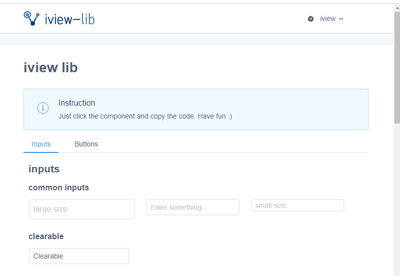

# iview-lib


This is a template lib for iview components. It contains common code segments of iview components like buttons, you can click it and get the code copy quickly.



## Project setup

The setup process just like other vue projects.

```
npm install
```

### Compiles and hot-reloads for development
```
npm run serve
```

### Compiles and minifies for production
```
npm run build
```

### Lints and fixes files
```
npm run lint
```

### Customize configuration
See [Configuration Reference](https://cli.vuejs.org/config/).

## License

MIT License